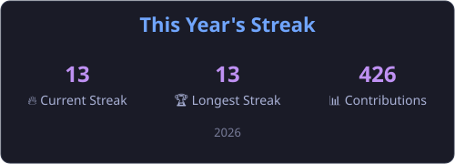

# Hi there! 👋 I'm Abdessamad EL HACHAMI  

🎓 Final-year Software Engineering student @ **ENSA Agadir**  
☁️ Passionate about **Cloud Computing**, **DevOps**, and **AI-driven Automation**  
💡 I love building scalable, intelligent systems and integrating LLMs into real-world workflows.  
🚀 Currently exploring **Full Stack Development**, **DevSecOps**, and **MLOps**.  

---

## 🧠 About Me  

- 🧩 I bridge **software development** and **operations** to design reliable, secure, and automated systems.  
- 💬 I enjoy collaborating on projects that combine **AI**, **automation**, and **DevOps** practices.  
- 🧰 My favorite tools: Docker, Kubernetes, Terraform, Jenkins, LangChain, and FastAPI.  
- 🌍 Always learning and sharing knowledge about **AI orchestration** and **Cloud Infrastructure**.  

---

## 🛠️ Technologies & Tools  

### 💻 Programming & Frameworks  

---

### ☁️ Cloud & DevOps  

---

### 🤖 AI & Automation  

---

### 🗄️ Databases  

---

### 🧩 Tools & Collaboration  

---

## 🚀 Featured Projects  

- 🧠 **AI Chatbot Platform (RAG + LangChain)** — Hybrid Retrieval-Augmented Generation chatbot with FastAPI backend and Next.js frontend.  
- ⚙️ **Automation System for Internship Applications** — Email monitoring, smart follow-ups, and analytics using Python + n8n.  
- ☁️ **Cloud Cost Optimization Simulator** — Terraform + AWS for infrastructure cost analysis and visualization.  
- 🧩 **Agile Project Management Platform** — Full-stack application using Spring Boot, React, and PostgreSQL.

---

## 📊 GitHub Stats  

---

## 🌍 Connect With Me  

